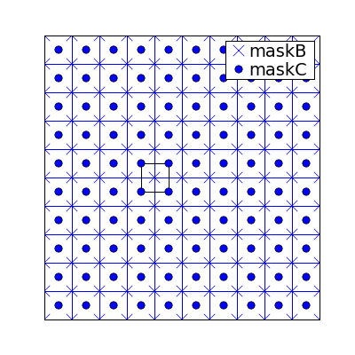

============
Introduction
============
 
.. default-role:: math

This is the documentation for the McGill Sea Ice Model.

Masks 
~~~~~

The model uses a mask filled with integers to identify land from ocean. 
Ocean is marked with 1, and land is marked with 0. 

There are two masks that are used in the model: `maskC` and `maskB`. `maskC` is
a `n_x+2\times n_y+2` array that indicates the presence of land at the cell center. 
`maskB` is called the velocity mask and has one more element in each dimension.

  
  In the figure, dots stand for the ocean/land mask. The `x` stand for the 
  `maskB`, also called the velocity mask. An element in `maskB` is set to 1 if 
  all the surrounding points in `maskC` are equal to 1. Hence, all points
  on the borders of the grid are equal to 0. 

Eventually, it would be cleaner to use a logical mask instead of an integer 
mask. This would simplify some expressions and the code could then use the 
instrinsic functions in Fortran 90 that take logical mask as arguments. 

Finite Differences
~~~~~~~~~~~~~~~~~~
The standard way to compute finite differences (numerical derivatives) is to use
Taylors series expansion formula at different locations:

.. math:: 
   
   f(x+\delta) & \approx f(x) + \delta f'(x) + \delta^2 f''(x)/2 + O(\delta^3) \\
   f(x-\delta) & \approx f(x) - \delta f'(x) + \delta^2 f''(x)/2 + O(\delta^3)

and solve for the desired expression. For instance, if we substract the second 
equation from the fist, we get the central difference formula for the first
derivative:

.. math:: 

   f'(x) = \frac{f(x+\delta) - f(x-\delta)}{2\delta} + O(\delta^2)

Similarly, if we add both equations, we get the central difference 
formula for the second derivative:

.. math:: 

   f''(x) = \frac{f(x+\delta) -2f(x) + f(x-\delta)}{2\delta^2} + O(\delta^2)

This is all very fine, but in practice, we have situations where we know
`f(x), f(x+\delta)` and  `f(x-\delta/2)` and we want the derivative `f'(x)`. 
Using substitutions can get hairy. An elegant way out if this is to use Newton's
divided difference interpolation formula: 

.. math:: 

   f(x) \approx f_0 + (x-x_0)f[x_0,x_1] + (x-x_0)(x-x_1)f[x_0,x_1,x_2] + ...

where `f[x_0,x_1] = \frac{f_1 -f_0}{x_1-x_0}` and 

.. math:: 
   
   f[x0,...,x_k] = \frac{f[x_1,...,x_k] - f[x_0,...,x_{k-1}]}{x_k-x_0}.

By differentiating `f(x)`, we can find the derivative at any place, knowing the 
value of the function at `x_0, x_1` and `x_2`:

.. math:: 

   f'(x) \approx f[x_0, x_1] + (2x-x_1-x_0)f[x_0,x_1,x_2] + ...

So, to being, let's assume `x_{i+1}=x_i+h`, we can simplify things quite a bit:

.. math:: 
   
    f[x_0, x_1] & = \frac{f_1 - f_0}{h} \\
    f[x_0,x_1,x_2] & = \frac{f_0 - 2f_1 +f_2}{2h^2}
    
So that taking `x=x_0` yields:

.. math:: 
   
   f'_0 & = \frac{f_1 - f_0}{h} - h \frac{f_0 - 2f_1 +f_2}{2h^2} \\
        & = \frac{-3f_0 + 4f_1 -f_2}{2h}

And similarly for `x=x_1` and `x=x_2`:

.. math::
   
   f'_1 & = \frac{-f_0 + f_2}{2h} \\
   f'_2 & = \frac{f_0 -4f_1 +3f_2}{2h}

The three last formulas correspong to the forward, central and backward 
difference formulas of the second order. 

Now this is very useful to compute the derivative at points that are not 
multiples of `h`. For instance, imagine we have ice velocities at points `i` and 
`i+1`, but we know that at point `i-1/2`, the velocity is 0 because of a land
mass. The distance between points `i` and `i+1` is `h`, and between `i-1/2` and 
`i` the distance is `h/2`, so:

.. math:: 

   f[x_{i-1/2}, x_i] & = \frac{2f_i}{h} \\
   f[x_{i-1/2},x_i,x_{i+1}] & = \frac{2}{3h^2}(f_{i+1}-3f_i)

and 

.. math:: 

   f'_i  & = \frac{2f_i}{h} + \frac{h}{2}\frac{2}{3h^2}(f_{i+1}-3f_i) \\
         & = \frac{6f_i + f_{i+1} - 3f_i }{3h} \\
         & = \frac{3f_i + f_{i+1}}{3h}

Practical Cases
---------------

Assume u and v are on a staggered C grid. Let's say we want to compute 
`\partial_x u` at the grid center. This can be computed simply using central 
differences: `(u_{i,j} - u_{i+1,j})/\delta`. Cast in the divided difference 
notation, we would have: `f_0 = u_{i,j}, f_1 = ., f_2=u{i+1,j}` and
`x_0=0, x_1=\delta/2, x_2=\delta`.

Now assume we want `\partial_x v` at the node center. First, we compute the 
vertical average to obtain values at the nodes: 
`v'_{i,j} = (v_{i,j} + v_{i,j+1})/2`. Then we apply the divided difference 
formula with: `f_0= v'_{i-1, j}, f_1=v'_{i,j}, f_2=v'_{i,j+1}` and 
`x_0=0`, x_1=\delta, x_2=\delta`. 

Now imagine there is a land mass on the node `i-1,j`, we would then have:
`f_0=0, f_1=v'_{i,j}, f_2=v'_{i+1,j}` and `x_0=0, x_1=\delta/2, x_2=3\delta/2`. 

And similarly if the mask is on the right side. Now the idea is to write 
functions that deal gracefully with all these cases wihout too much special 
casing, which is numerical recipe for bugs. 

  

